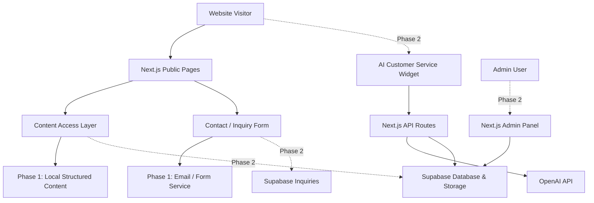

# 化工官网架构设计

## 1. 架构目标

本项目采用分阶段架构：

- 一期优先快速上线、静态生成、SEO 友好、低维护成本。
- 产品内容从第一天开始结构化，避免写死在页面中。
- 页面、组件、数据模型为二期后台和 AI 客服预留扩展空间。
- 二期引入 Supabase 后，尽量只替换数据来源，不重写前台页面。

总体原则：

- 前台页面只关心展示。
- 产品数据通过统一的数据访问层读取。
- 产品详情、首页推荐、相关产品、对比模块都来自同一份产品数据。
- 联系表单和 AI 客服属于转化链路，后续统一进入询盘系统。

## 2. 总体架构



## 3. 推荐目录结构

未来迁移到 Next.js 后，建议目录如下：

```txt
src/
  app/
    layout.tsx
    page.tsx
    products/
      page.tsx
      [slug]/
        page.tsx
    why-us/
      page.tsx
    about/
      page.tsx
    contact/
      page.tsx
    api/
      inquiry/
        route.ts
      ai-chat/
        route.ts
    admin/
      page.tsx
      products/
        page.tsx
  components/
    layout/
      Header.tsx
      Footer.tsx
      LanguageSwitcher.tsx
    home/
      Hero.tsx
      FeaturedProducts.tsx
      ApplicationGrid.tsx
    products/
      ProductCard.tsx
      ProductTable.tsx
      ProductDetail.tsx
      ProductComparison.tsx
      RelatedProducts.tsx
    contact/
      InquiryForm.tsx
    ai/
      ChatWidget.tsx
  content/
    products.ts
    categories.ts
    site.ts
  lib/
    products.ts
    categories.ts
    seo.ts
    i18n.ts
    supabase.ts
  types/
    product.ts
    inquiry.ts
```

一期可以先不实现 `admin`、`api/ai-chat`、`supabase.ts`，但保留架构边界。

## 4. 页面路由设计

| 页面 | 路由 | 生成方式 | 数据来源 |
| --- | --- | --- | --- |
| 首页 | `/` | 静态生成 | 站点信息、推荐产品、行业应用 |
| 产品列表 | `/products` | 静态生成 | 全部已发布产品、分类 |
| 产品详情 | `/products/[slug]` | 静态生成 | 单个产品、相关产品、对比信息 |
| Why Us | `/why-us` | 静态生成 | 静态内容 |
| About | `/about` | 静态生成 | 静态内容 |
| Contact | `/contact` | 静态生成 + 表单提交 | 联系信息、询盘表单 |
| 管理后台二期 | `/admin` | 登录后访问 | Supabase |

产品详情页使用 `slug` 作为稳定 URL，例如：

```txt
/products/sodium-carbonate
/products/industrial-solvent-a
/products/water-treatment-polymer
```

## 5. 产品数据模型

一期产品数据建议从 `src/content/products.ts` 读取。

```ts
export type ProductDocumentType = "COA" | "TDS" | "SDS";

export type ProductSpec = {
  label: string;
  value: string;
};

export type ProductComparisonItem = {
  dimension: string;
  typicalAlternative: string;
  aowattApproach: string;
};

export type Product = {
  slug: string;
  name: string;
  nameZh?: string;
  category: string;
  casNo?: string;
  summary: string;
  summaryZh?: string;
  overview: string;
  overviewZh?: string;
  grade?: string;
  purity?: string;
  packaging: string[];
  applications: string[];
  documents: ProductDocumentType[];
  specs: ProductSpec[];
  comparison: ProductComparisonItem[];
  relatedProductSlugs: string[];
  image: string;
  heroImage?: string;
  featured: boolean;
  published: boolean;
  sortOrder: number;
  seoTitle?: string;
  seoDescription?: string;
};
```

分类数据建议独立维护：

```ts
export type ProductCategory = {
  slug: string;
  name: string;
  nameZh?: string;
  summary: string;
  summaryZh?: string;
  image: string;
  sortOrder: number;
};
```

## 6. 数据访问层

不要在页面中直接 `import products` 后手写过滤逻辑。建议通过 `lib/products.ts` 暴露统一方法：

```ts
getPublishedProducts()
getFeaturedProducts()
getProductBySlug(slug)
getProductsByCategory(categorySlug)
getRelatedProducts(product)
getProductStaticParams()
```

一期这些方法读取本地结构化文件。

二期这些方法可以改为读取 Supabase，页面组件尽量不变。

## 7. 首页产品展示策略

首页产品不写死，也不运行时查库。

一期：

- 从 `getFeaturedProducts()` 获取产品。
- 只展示 `published: true` 且 `featured: true` 的产品。
- 按 `sortOrder` 排序。
- 数量建议控制在 3 到 6 个。

二期：

- 后台维护 `featured` 和 `sortOrder`。
- 前台继续通过同一个 `getFeaturedProducts()` 获取。
- 如果产品更新频率不高，仍可静态生成并通过 webhook 触发重新部署。

## 8. 国际化设计

一期建议采用轻量双语方案：

- 英文作为默认语言。
- 产品数据中保留 `nameZh`、`summaryZh`、`overviewZh` 等中文字段。
- 通用 UI 文案放在 `lib/i18n.ts`。
- 语言选择记录在浏览器 `localStorage` 或 URL 参数中。

如果后续需要完整中英文独立 SEO 页面，再扩展为路由级国际化：

```txt
/en/products/sodium-carbonate
/zh/products/sodium-carbonate
```

当前阶段不建议一开始就做复杂 i18n 路由，以免拖慢一期上线。

## 9. 询盘架构

一期联系表单建议使用轻量方案：

- Next.js API Route 接收表单。
- 使用邮件服务发送到公司邮箱。
- 表单字段包括：姓名、公司、邮箱、电话、目标产品、需求描述。
- 同时保留 WhatsApp、电话、邮箱直接联系入口。

二期升级：

- 询盘写入 Supabase `inquiries` 表。
- 管理后台查看询盘列表。
- 支持状态：`new`、`contacted`、`qualified`、`closed`。
- AI 客服生成的线索也进入同一张询盘表。

## 10. 二期 Supabase 架构

建议二期 Supabase 表结构：

| 表名 | 用途 |
| --- | --- |
| `products` | 产品主数据 |
| `categories` | 产品分类 |
| `product_documents` | SDS / TDS / COA 文件 |
| `inquiries` | 联系表单和 AI 客服线索 |
| `chat_sessions` | AI 客服会话 |
| `chat_messages` | AI 客服消息记录 |
| `ai_knowledge_chunks` | 产品知识库切片 |
| `admin_users` | 管理员信息或权限映射 |

文件存储：

- 产品图片放 Supabase Storage 或对象存储。
- SDS / TDS / COA 文件放私有或受控公开 bucket。
- 前台只展示允许公开的文件。

## 11. AI 客服架构

AI 客服建议作为二期独立模块接入。

前台：

- `ChatWidget` 显示在网站右下角。
- 允许用户询问产品、文件、包装、应用、联系方式。
- 在合适时机收集联系方式和需求。

服务端：

- `app/api/ai-chat/route.ts` 接收聊天消息。
- 从 Supabase 查询相关产品和 FAQ。
- 调用 OpenAI API 生成回答。
- 将会话和消息写入 `chat_sessions`、`chat_messages`。
- 识别高价值线索后写入 `inquiries`。

安全边界：

- 不承诺实时价格。
- 不替代 SDS 或法规建议。
- 不确认危险品运输、合规责任或法律承诺。
- 遇到不确定、敏感、价格、合规类问题转人工。

## 12. SEO 架构

每个页面应通过统一的 SEO helper 生成 metadata：

- 首页：公司定位和主营品类。
- 产品列表页：覆盖产品分类和供应能力。
- 产品详情页：产品名、CAS、应用、包装、文档能力。
- Contact 页：强调询盘和人工联系。

产品详情页 URL 应长期稳定，避免频繁修改 `slug`。

建议生成：

- `title`
- `description`
- `canonical`
- Open Graph title
- Open Graph description
- Open Graph image

## 13. 部署架构

一期：

```txt
GitHub Repository
  -> Vercel Build
  -> Static / Serverless Deployment
  -> Custom Domain
  -> Optional Cloudflare DNS / CDN
```

二期：

```txt
Next.js on Vercel
  -> Supabase Database
  -> Supabase Storage
  -> OpenAI API
  -> Email Service
```

环境变量建议：

```txt
NEXT_PUBLIC_SITE_URL=
NEXT_PUBLIC_SUPABASE_URL=
NEXT_PUBLIC_SUPABASE_ANON_KEY=
SUPABASE_SERVICE_ROLE_KEY=
OPENAI_API_KEY=
INQUIRY_EMAIL_TO=
EMAIL_SERVICE_API_KEY=
```

一期只需要配置实际用到的域名和表单服务变量。

## 14. 开发阶段拆分

### Phase 1: Next.js 静态官网

- 搭建 Next.js + TypeScript + Tailwind。
- 按现有设计迁移首页和公共布局。
- 建立产品数据模型和本地产品数据文件。
- 实现产品列表和产品详情静态生成。
- 实现联系页和询盘表单。
- 完成基础 SEO。
- 部署到 Vercel 并绑定域名。

### Phase 2: 运营后台

- 接入 Supabase。
- 建立数据库表和文件存储。
- 增加管理员登录。
- 增加产品、分类、文件、询盘管理。
- 将前台数据来源从本地文件迁移到 Supabase。

### Phase 3: AI 客服

- 整理产品知识库和 FAQ。
- 建立知识库切片。
- 接入 OpenAI API。
- 增加聊天组件和聊天 API。
- 记录会话、消息和线索。
- 增加人工介入规则。

## 15. 关键架构决策

- 一期产品数据用结构化文件，不写死页面，不运行时查库。
- 前台页面通过数据访问层获取产品，方便二期替换数据源。
- 产品详情使用 `slug` 静态生成，保证 SEO 和访问速度。
- 后台、数据库、AI 客服放到二期，避免一期过度建设。
- 联系表单和 AI 客服线索最终统一进入 `inquiries`。
- SDS / TDS / COA 文件从一开始作为产品模型的一部分设计。
